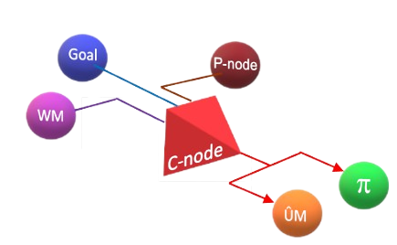
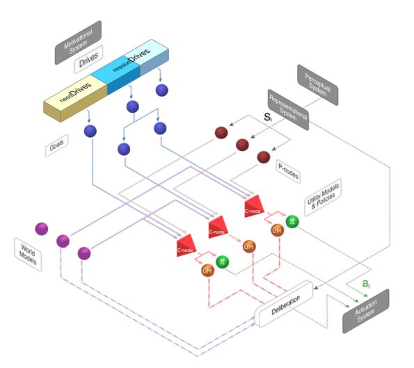

# Concepts

## Cognitive nodes in e-MDB

The Cognitive Nodes form the Contextual Memory of the Long-Term Memory (LTM) of the e-MDB cognitive architecture. 

With the aim of providing an autonomously generated pseudo-rule-based structure that can facilitate decision explainability in the future, the fundamental concept guiding decision-making organization within the LTM is that of Contextual Cognitive Node (C-Node). This node links the knowledge elements that make up a context. In this initial implementation, these elements include the domain the robot operates in, represented by the active world model (WM), the goal it aims to achieve (G), its current perception (in the form of a Perceptual Equivalence Class, or P-Node), and the required skill to transition, in this context, from its current perception to the goal. This skill is given in the form of a Policy (𝜋), in the case of reactive decision-making, or an Expected Utility Model (Û𝑀), in the case of deliberative decision-making. Consequently, a C-node is activated by the product of the activation values of its components {WM, G and P-Node} and this activation, is propagated to the skills.

Thus, the LTM is a dynamic entity that is made up of all the cognitive nodes the system has been endowed with in an innate manner and those it learns as it interacts with the world. 

A picture of the architecture from the point of view of the knowledge it stores, and its
relation to the perception, actuation, and motivational systems, is shown in the following picture:

The different nodes represented in the diagram are:

- **Sensing (Sp):** Sensing refers to the information directly obtained from the robot sensors. These could also be taken as the raw or level-0 perceptions of the system. 
It is not a cognitive node as such.

- **Perceptual re-descriptors (RPp):** These are functions denoted as RPp that represent the transition between two different internal representations of perceptual/state information of the robot, including the real sensed values given by the sensors of the robot. These functions could even be identity functions, which would imply that the architecture could work directly with raw sensor values.

- **Perceptions (Pn):** The set of perceptions contains all direct and redescribed information originating from sensors of the physical environment and the robot's body, as well as virtual sensors obtaining information from internal cognitive processes.

- **P-Nodes (pNq):** They correspond to one of the types of equivalence classes the architecture works with. In this case perceptual equivalence classes. That is, they are a way to operationally discretize the mostly continuous and high-dimensional perceptual space. These classes arise from operational needs when working in continuous domains. They may correspond to meta-knowledge in terms, for instance, of indicating the area in state space where a World Model is known to be valid. Another example is related to contextual classes. In this case, perceptions corresponding to the same perceptual equivalence class, and thus represented by the same P-node, have in common that by applying the same action in the same domain, the same perceptual situation Pt+1 is reached.

- **Drives (Dx):** Drives can be defined as a function that provides a measure of how desirable the satisfaction of a motivational desire is. Drives are directly related with **Needs**, which represent a desired internal state of the robot.

- **Goals (Gs):** They correspond to another one of the perceptual equivalence classes the architecture considers. Goals represent areas in the state space that, when reached, lead to the reduction of the value of at least one of the drives that are part of the robot’s motivational system(that is, they are implicitly rewarded areas). As a consequence, and as reward is usually domain dependent, they are dependent on the domain of operation, i.e. the same area of the state space can be a goal in one domain and not in others. Goals provide utility/reward, which is associated with the amount of reduction of the drive whose value decreased when reaching them.

- **World Models (WMv):** They correspond to transition functions that represent the behavior of the domain in which the robot is operating. They are usually instantiated as a predictor of the perceptual situation Pt+1 that will result from the application of an action when in a perceptual state Pt.

- **Expected Utility Models (ÛMt):** An expected utility model is a function associated with a goal, Gs, which provides the expected utility (value in RL terms), û, of the perceptual space points Pt in a particular domain. That is, the probability of reaching Gs, from observation Pt modulated by the utility achieved when it is reached. When considered jointly with a world model within a deliberative process they can be used in decision making.

- **Policies (πw):** A policy is a reactive decision structure in the form of a procedural component that provides the action to apply when at a given perceptual point Pt. To be useful, each action is usually related to the achievement of a goal, Gs.

- **C-Nodes (cNu):** C-nodes represent contexts. They link P-nodes (initial observations), with goals (final observations) and the skills or procedures needed to move from the former to the latter in a given domain (domain represented by its world model). C-node activation levels are dependent on the activation value of the knowledge nodes they contextualize. 

- **Actuation re-descriptors (RAx):** Functions that transform actuations from one internal action space representation the robot is using to another, which might even be the final primitive actions of the robot (including the case of detailed commands to the robot actuators).

- **Actions (Ay):** They represent the primitive actions of the robot architecture (provided by the designer). These include both the actions that affect the robot actuators and the internal actions over the cognitive architecture itself and its individual knowledge components.

At this moment, the following cognitive nodes are implemented in the software: Perception, P-Node, Goals, World Models, C-Nodes and Policies. Needs, Drives and Utility Models are work in progress. You can check them in the [API documentation](../cognitive_nodes/api_documentation.rst)

More conceptual information about the e-MDB cognitive architecture could be found in the Deliverable 5.1 in [PILLAR Robots official web](https://pillar-robots.eu/deliverables/)

## What is the Space script?

If you check the [API documentation](../cognitive_nodes/api_documentation.rst) or directly the code from the repository, you can see that exists a script called space.py, that doesn't correspond to any cognitive node.

That script is used, at this moment, to calculate the activation of the P-Nodes. 
Depending on whether a reward was obtained or not after executing the action, the initial perceptual state, Pt, will be added to the P-Node as point or anti-point, respectively. To store those perceptual states, a Space, created with that script, is used.

With the perceptual states stored in the Space, the P-Node calculates its activation, using one of the following classes:

- **PointBased Space:** Uses rules that relate the position of the new perceptual state to the closest old ones in the Space.
- **SVM Space:** Uses SVMs, with Scikit-learn.
- **ANN Space:** Uses Artificial Neural Networks, with Tensorflow.

The class to use can be selected in the experiment YAML file.

Spaces could be used in other cognitive nodes, such as Goals.

## Topics and services

Cognitive nodes use several topics and services to interact with them. Some of them are common to all, while others are specific to each node.  The first ones can be found in the [emdb_core repository documentation](https://docs.pillar-robots.eu/projects/emdb_core/en/latest/). The latter can be found in the [API documentation](../cognitive_nodes/api_documentation.rst) of this repository, being specified on each implemented node.
