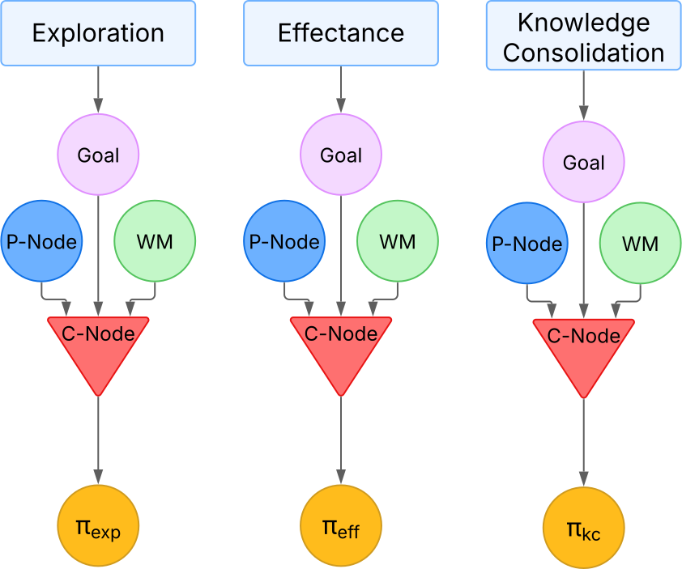

# Concepts

## Cognitive nodes in e-MDB

The Cognitive Nodes form the Contextual Memory of the Long-Term Memory (LTM) of the e-MDB cognitive architecture. 

With the aim of providing an autonomously generated pseudo-rule-based structure that can facilitate decision explainability in the future, the fundamental concept guiding decision-making organization within the LTM is that of **Contextual Cognitive Node (C-Node)**. This node links the knowledge elements that make up a context. In this initial implementation, these elements include the domain the robot operates in, represented by the active **World Model (WM)**, the **goal** it aims to achieve **(G)**, its **current perception** (in the form of a Perceptual Equivalence Class, or **P-Node**), and the required **skill** to transition, in this context, from its current perception to the goal. This skill is given in the form of a **Policy (𝜋)**, in the case of reactive decision-making, or an **Expected Utility Model (Û𝑀)**, in the case of deliberative decision-making. Consequently, a C-node is activated by the product of the activation values of its components **{WM, G and P-Node}** and this activation, is propagated to the skills.

*Schematic of a context node*

Thus, the LTM is a dynamic entity that is made up of all the cognitive nodes the system has been endowed with in an innate manner and those it learns as it interacts with the world. 

A picture of the architecture from the point of view of the knowledge it stores, and its
relation to the perception, actuation, and motivational systems, is shown in the following picture:

*Schematic of the architecture memory structure*

The different nodes represented in the diagram are:

- **Sensing (Sp):** Sensing refers to the information directly obtained from the robot sensors. These could also be taken as the raw or level-0 perceptions of the system. 
It is not a cognitive node as such.

- **Perceptual re-descriptors (RPp):** These are functions denoted as RPp that represent the transition between two different internal representations of perceptual/state information of the robot, including the real sensed values given by the sensors of the robot. These functions could even be identity functions, which would imply that the architecture could work directly with raw sensor values.

- **Perceptions (Pn):** The set of perceptions contains all direct and redescribed information originating from sensors of the physical environment and the robot's body, as well as virtual sensors obtaining information from internal cognitive processes.

- **P-Nodes (pNq):** They correspond to one of the types of equivalence classes the architecture works with. In this case perceptual equivalence classes. That is, they are a way to operationally discretize the mostly continuous and high-dimensional perceptual space. These classes arise from operational needs when working in continuous domains. They may correspond to meta-knowledge in terms, for instance, of indicating the area in state space where a World Model is known to be valid. Another example is related to contextual classes. In this case, perceptions corresponding to the same perceptual equivalence class, and thus represented by the same P-node, have in common that by applying the same action in the same domain, the same perceptual situation Pt+1 is reached.

- **Drives (Dx):** Drives can be defined as a function that provides a measure of how desirable the satisfaction of a motivational desire is. Drives are directly related with **Needs**, which represent a desired internal state of the robot.

- **Goals (Gs):** They correspond to another one of the perceptual equivalence classes the architecture considers. Goals represent areas in the state space that, when reached, lead to the reduction of the value of at least one of the drives that are part of the robot’s motivational system (that is, they are implicitly rewarded areas). As a consequence, and as reward is usually domain dependent, they are dependent on the domain of operation, i.e. the same area of the state space can be a goal in one domain and not in others. Goals provide utility/reward, which is associated with the amount of reduction of the drive whose value decreased when reaching them.

- **World Models (WMv):** They correspond to transition functions that represent the behavior of the domain in which the robot is operating. They are usually instantiated as a predictor of the perceptual situation Pt+1 that will result from the application of an action when in a perceptual state Pt.

- **C-Nodes (cNu):** C-nodes represent contexts. They link P-nodes (initial observations), with goals (final observations) and the skills or procedures needed to move from the former to the latter in a given domain (domain represented by its world model). C-node activation levels are dependent on the activation value of the knowledge nodes they contextualize. 

- **Expected Utility Models (ÛMt):** An expected utility model is a function associated with a goal, Gs, which provides the expected utility, û, of the perceptual space points Pt in a particular domain. That is, the probability of reaching Gs, from observation Pt modulated by the utility achieved when it is reached. When considered jointly with a World Model within a deliberative process they can be used in decision making.

- **Policies (πw):** A policy is a reactive decision structure in the form of a procedural component that provides the action to apply when at a given perceptual point Pt. To be useful, each action is usually related to the achievement of a goal, Gs.

- **Actuation re-descriptors (RAx):** Functions that transform actuations from one internal action space representation the robot is using to another, which might even be the final primitive actions of the robot.

- **Actions (Ay):** They represent the primitive actions of the robot architecture (provided by the designer).

More conceptual information about the e-MDB cognitive architecture can be found in the Deliverable 5.1 in [PILLAR Robots official web](https://pillar-robots.eu/deliverables/)

## Intrinsic Motivations

Intrinsic motivations are internal mechanisms that guide an autonomous system to interact with its environment in meaningful ways, even when no external rewards are provided. These motivations are crucial for robots that aim to continuously learn and adapt, especially in open-ended and dynamic environments.

In the e-MDB cognitive architecture, intrinsic motivations enable the robot to autonomously generate goals and sub-goals, refine perceptual representations, and construct complex behavioral sequences. This self-motivated behavior is essential for achieving Lifelong Open-ended Learning Autonomy (LOLA).

The following intrinsic motivations are implemented:

- Exploration
- Effectance
- Prospection

Each of these mechanisms contributes to the autonomous creation and organization of knowledge nodes, such as goals and P-Nodes, which are stored and managed by the architecture's Long-Term Memory (LTM).

*Intrinsic Motivations structure in the LTM*

### Exploration

Exploration encourages the robot to actively seek new and previously unvisited areas of its perceptual space. The system is motivated to identify novel situations and construct new P-Nodes and goals that help represent and structure the state space.
Within the e-MDB cognitive architecture, exploration is a fundamental intrinsic motivation expand its knowledge. This exploration, at this moment, can be operated by two mechanisms:

1. **Random Exploration**: The robot randomly selects actions to explore its environment. This approach allows the system to discover new perceptual states and learn about them without any prior knowledge or specific goals. Random exploration is particularly useful in the early stages of learning, where the robot has limited information about its surroundings.

2. **Novelty-Based Exploration**: The system monitors its current state and, when it recognizes it as familiar, sets a goal to reach a state it has not visited before. By predicting the outcomes of its actions, it chooses those likely to lead to new experiences. This process allows the robot to gradually explore and learn about its environment. 

3. **LLM-Guided Exploration**: Leveraging Large Language Models, the system can strategically direct its exploration based on understanding the user's purpose. The LLM interprets the user's intentions and guides the robot to discover relevant goals that align with these intentions. Additionally, the LLM suggests appropriate actions that help the robot achieve these goals efficiently. This purpose-aware exploration allows the robot to focus on meaningful objectives rather than random searching, creating a more efficient and directed learning process.

The use of these exploration mechanisms enables the robot to efficiently discover and categorize new perceptual states, which then become the building blocks for more complex goal hierarchies. Through this process, the robot autonomously structures its knowledge base in ways that facilitate future task learning and adaptation to new situations.

### Effectance

Effectance motivates the cognitive architecture to interact with the environment in ways that produce clear and measurable effects—both internally, in its own knowledge structures, and externally, in the environment. This form of intrinsic motivation encourages the robot to understand how its actions influence the world, leading to the discovery of cause-effect relationships and the construction of structured, goal-driven behavior. It currently operates through two complementary mechanisms:

1. **Internal Effectance**: This mechanism encourages the robot to strengthen and refine its internal understanding of the world. When the robot detects that a particular P-Node has become well-learned, it creates goals that lead it to revisit and consolidate this knowledge. These goals help stabilize learning and support the formation of goal hierarchies rooted in well-understood perceptual states.

2. **External Effectance**: This mechanism motivates the robot to perform actions that cause noticeable changes in its environment. For example, when a sensor value changes as a result of the robot’s action, the system treats this as a meaningful effect. It then creates goals that aim to recreate those effects, reinforcing the connection between specific actions and their outcomes. Over time, this helps the robot build a library of reliable interactions it can use in future tasks.

Together, these two aspects of effectance enable the robot to ground its learning in both internal knowledge development and real-world consequences. This dual focus allows it to build a robust, hierarchical understanding of how its actions shape both perception and the environment—laying the foundation for more purposeful and adaptive behavior.

*Internal effectance behavior* 

### Knowledge consolidation: Prospection

Prospection allows the robot to discover useful relationships between its existing goals by analyzing how they overlap in space. By recognizing when one goal is contained within or closely related to another, the system can build structured hierarchies of goals that support more efficient learning and planning.

Within the e-MDB cognitive architecture, prospection helps organize the robot’s knowledge in a way that promotes reusability and strategic behavior. This process relies on analyzing the robot’s memory to detect meaningful patterns among previously learned goals and perceptual states.

Through prospection, the robot builds a layered understanding of its goals, allowing it to organize its behavior in increasingly sophisticated ways. By reusing what it already knows, the robot becomes better at solving complex tasks with less effort.

*Prospection*

