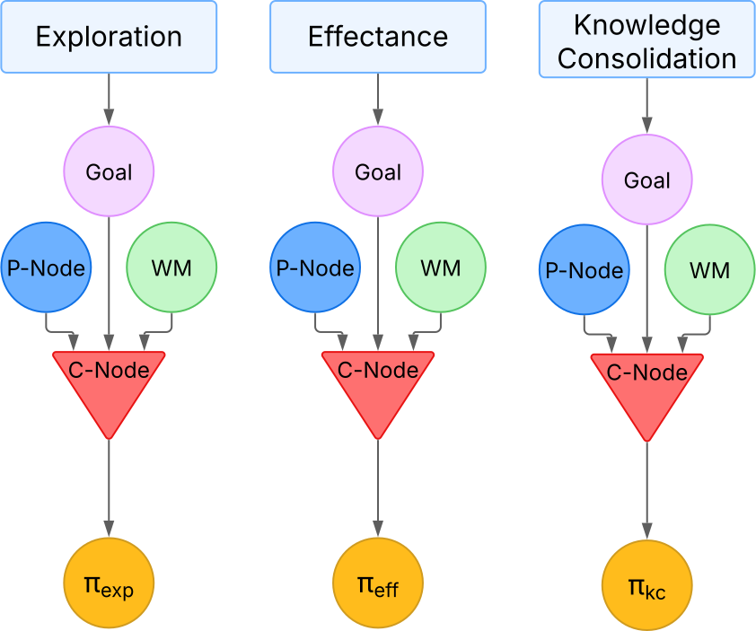

# Intrinsic Motivations

Intrinsic motivations are internal mechanisms that guide an autonomous system to interact with its environment in meaningful ways, even when no external rewards are provided. These motivations are crucial for robots that aim to continuously learn and adapt, especially in open-ended and dynamic environments.

In the e-MDB cognitive architecture, intrinsic motivations enable the robot to autonomously generate goals and sub-goals, refine perceptual representations, and construct complex behavioral sequences. This self-motivated behavior is essential for achieving Lifelong Open-ended Learning Autonomy (LOLA).

The following intrinsic motivations are implemented:

- Exploration
- Effectance
- Prospection

Each of these mechanisms contributes to the autonomous creation and organization of knowledge nodes, such as goals and P-Nodes, which are stored and managed by the architecture's Long-term Memory (LTM).

*Intrinsic Motivations structure in the LTM*

## Exploration

Exploration encourages the robot to actively seek new and previously unvisited areas of its perceptual space. The system is motivated to identify novel situations and construct new P-Nodes and goals that help represent and structure the state space.
Within the e-MDB cognitive architecture, exploration is a fundamental intrinsic motivation expand its knowledge. This exploration, at this moment, can be operated by two mechanisms:

1. **Random Exploration**: The robot randomly selects actions to explore its environment. This approach allows the system to discover new perceptual states and learn about them without any prior knowledge or specific goals. Random exploration is particularly useful in the early stages of learning, where the robot has limited information about its surroundings.

2. **Novelty-Based Exploration**: The system monitors its current state and, when it recognizes it as familiar, sets a goal to reach a state it has not visited before. By predicting the outcomes of its actions, it chooses those likely to lead to new experiences. This process allows the robot to gradually explore and learn about its environment. 

3. **LLM-Guided Exploration**: Leveraging Large Language Models, the system can strategically direct its exploration based on understanding the user's purpose. The LLM interprets the user's intentions and guides the robot to discover relevant goals that align with these intentions. Additionally, the LLM suggests appropriate actions that help the robot achieve these goals efficiently. This purpose-aware exploration allows the robot to focus on meaningful objectives rather than random searching, creating a more efficient and directed learning process.

The use of these exploration mechanisms enables the robot to efficiently discover and categorize new perceptual states, which then become the building blocks for more complex goal hierarchies. Through this process, the robot autonomously structures its knowledge base in ways that facilitate future task learning and adaptation to new situations.

## Effectance

Effectance motivates the cognitive architecture to interact with the environment in ways that produce clear and measurable effects—both internally, in its own knowledge structures, and externally, in the environment. This form of intrinsic motivation encourages the robot to understand how its actions influence the world, leading to the discovery of cause-effect relationships and the construction of structured, goal-driven behavior. It currently operates through two complementary mechanisms:

1. **Internal Effectance**: This mechanism encourages the robot to strengthen and refine its internal understanding of the world. When the robot detects that a particular P-Node has become well-learned, it creates goals that lead it to revisit and consolidate this knowledge. These goals help stabilize learning and support the formation of goal hierarchies rooted in well-understood perceptual states.

2. **External Effectance**: This mechanism motivates the robot to perform actions that cause noticeable changes in its environment. For example, when a sensor value changes as a result of the robot’s action, the system treats this as a meaningful effect. It then creates goals that aim to recreate those effects, reinforcing the connection between specific actions and their outcomes. Over time, this helps the robot build a library of reliable interactions it can use in future tasks.

Together, these two aspects of effectance enable the robot to ground its learning in both internal knowledge development and real-world consequences. This dual focus allows it to build a robust, hierarchical understanding of how its actions shape both perception and the environment—laying the foundation for more purposeful and adaptive behavior.

*Internal effectance behavior* 

## Knowledge consolidation: Prospection

Prospection allows the robot to discover useful relationships between its existing goals by analyzing how they overlap in space. By recognizing when one goal is contained within or closely related to another, the system can build structured hierarchies of goals that support more efficient learning and planning.

Within the e-MDB cognitive architecture, prospection helps organize the robot’s knowledge in a way that promotes reusability and strategic behavior. This process relies on analyzing the robot’s memory to detect meaningful patterns among previously learned goals and perceptual states.

Through prospection, the robot builds a layered understanding of its goals, allowing it to organize its behavior in increasingly sophisticated ways. By reusing what it already knows, the robot becomes better at solving complex tasks with less effort.

*Prospection*

